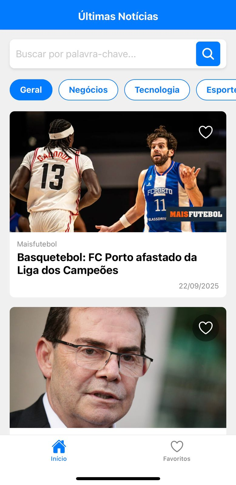

# Desafio Front-end: App de Notícias em React Native

Este é um aplicativo de notícias mobile desenvolvido em React Native como parte de um desafio de front-end. O app consome a API da [GNews](https://gnews.io/ ) para exibir as últimas notícias, permitindo ao usuário buscar, filtrar por categorias e salvar suas notícias favoritas para ler depois.

## 📱 Demonstração
**https://www.youtube.com/shorts/ZKRhas2Eqag**

 

## ✨ Funcionalidades Implementadas

### Requisitos Obrigatórios
-   [x] **Tela Inicial (Lista de Notícias):** Exibe as principais notícias com imagem de destaque, título, fonte e data.
-   [x] **Scroll Infinito:** Carrega mais notícias automaticamente quando o usuário chega ao final da lista.
-   [x] **Busca por Notícias:** Um campo de busca permite filtrar notícias por palavra-chave.
-   [x] **Tela de Detalhes:** Exibe o conteúdo completo de uma notícia ao ser selecionada, com um link para a matéria original.

### Funcionalidades Diferenciais
-   [x] ⭐ **Favoritos:** Permite salvar notícias localmente. O estado dos favoritos é sincronizado entre a tela inicial e a tela de favoritos.
-   [x] 📂 **Categorias:** Filtro para visualizar notícias por categorias (Geral, Tecnologia, Esportes, etc.).
-   [x] 📴 **Modo Offline:** Exibe as últimas notícias carregadas quando o aplicativo está sem conexão com a internet, com um indicador visual.

---

## 🛠️ Tecnologias e Bibliotecas

*   **React Native (com Expo):** Framework principal para o desenvolvimento mobile multiplataforma.
*   **JavaScript:** Linguagem de programação.
*   **Axios:** Cliente HTTP para fazer as requisições à API de notícias.
*   **React Navigation:** Para gerenciar a navegação entre telas (Stack e Bottom Tabs).
*   **AsyncStorage:** Para persistência de dados locais (notícias favoritas e cache para modo offline).
*   **NetInfo:** Para detectar o status da conexão com a internet e habilitar o modo offline.

---

## 🚀 Como Instalar e Rodar o Projeto

Siga os passos abaixo para executar o projeto localmente.

**Pré-requisitos:**
*   [Node.js](https://nodejs.org/en/ ) (versão LTS recomendada)
*   [Expo Go](https://expo.dev/client ) instalado no seu celular (Android ou iOS)

**1. Clone o repositório:**
```bash
git clone https://github.com/GhMalak/Teste_Desafio_React
cd meu-app-de-noticias
```

**2. Instale as dependências:**
```bash
npm install
```

**3. Crie sua chave da API:**
   - Acesse [gnews.io](https://gnews.io/ ), crie uma conta gratuita e obtenha sua API Key.
   - No arquivo `services/newsApi.js`, substitua o valor da constante `API_KEY` pela sua chave:
     ```javascript
     const API_KEY = 'SUA_CHAVE_DA_API_AQUI';
     ```

**4. Inicie o servidor de desenvolvimento do Expo:**
```bash
npx expo start
```

**5. Execute o aplicativo:**
   - Um QR Code aparecerá no seu terminal.
   - Abra o aplicativo **Expo Go** no seu celular e escaneie o QR Code.
   - O aplicativo será carregado no seu dispositivo.

---

## 🏗️ Estrutura de Pastas

O projeto está organizado da seguinte forma:

```
meu-app-de-noticias/
├── assets/             # Imagens e fontes estáticas
├── components/         # Componentes reutilizáveis (CardNoticia, BarraDeBusca, etc.)
├── hooks/              # Hooks customizados (useFavorites, useNewsCache)
├── screens/            # Componentes de tela (TelaInicial, TelaFavoritos, etc.)
├── services/           # Lógica de comunicação com a API (api.js)
├── App.js              # Arquivo principal, configuração da navegação
└── package.json        # Dependências e scripts do projeto
```
